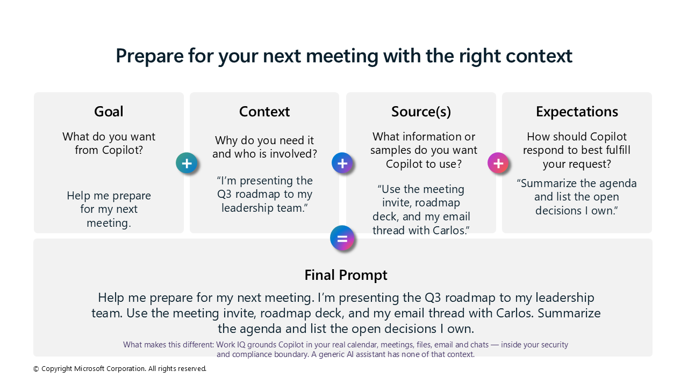

<!-- markdownlint-disable MD013 -->

# ✨ Prompting Best Practices

**Tell Copilot Chat what you need.** Prompts are how you ask Copilot to create, summarize, review, research, or help you complete a task.

Think of prompting as a conversation. Use clear, natural language and provide the context you would give to a trusted colleague or assistant.

## What You'll Learn {#what-youll-learn}

By the end of this guide, you will be able to:

- Recognize the four ingredients of an effective prompt
- Ground Copilot in the right work information
- Set clear expectations for the response
- Turn a simple request into a useful, actionable prompt

> [!NOTE]
> You do not need special syntax or technical language. Start with a clear request, add relevant context and sources, then describe the response you want.

## Prepare for Your Next Meeting {#prepare-for-your-next-meeting}

A basic request becomes much more useful when you add the desired outcome, business context, named sources, and expected response format.

The following practical example shows how to build a meeting-preparation prompt using all four ingredients. It also demonstrates how Work IQ can ground Copilot in your real work information, including your calendar, meetings, files, email, and chats.



> [!TIP]
> Before your next meeting, name at least one specific source in your prompt. This helps Copilot produce an answer that is current, relevant, and easier to verify.

## What Can You Ask Copilot to Do? {#what-copilot-can-do}

Copilot can help you with many common work tasks.

### Review text

```text
Check this product launch rationale for inconsistencies.
```

### Summarize information

```text
Write a session abstract for this presentation.
```

### Create engaging content

```text
Create a value proposition for our new product using [Product Information].
```

### Research a topic

```text
Give me the latest industry news about generative AI.
```

> [!TIP]
> Be conversational, be clear, and do not overthink your first prompt. You can refine the response through follow-up questions.

## The Four Ingredients of a Successful Prompt {#prompt-ingredients}

To get a more relevant and useful response, include four key ingredients:

| Ingredient | Question to answer |
| --- | --- |
| **Goal** | What response or outcome do you want from Copilot? |
| **Context** | Why do you need it, and who is involved? |
| **Source(s)** | Which files, meetings, messages, links, or examples should Copilot use? |
| **Expectations** | How should Copilot structure and present the response? |

### 1. Goal

State what you want Copilot to do. Put the goal first, or near the beginning of your prompt.

```text
Help me write an email to inform a customer about a product change.
```

### 2. Context

Explain why you need the response, who is involved, and any important circumstances.

```text
The customer is not a global administrator, so I need to explain the change in terms that are relevant to their role.
```

### 3. Source(s)

Direct Copilot to the information it should use. Naming specific sources is one of the most effective ways to improve the result.

```text
Use the product-change announcement at [Change URL].
```

Sources can include:

- A document, presentation, or workbook
- A meeting invitation or transcript
- An email thread or Teams conversation
- A web page or other reference
- An example of the style or format you want

### 4. Expectations

Describe what a good response looks like. Specify the format, length, tone, audience, or sections you need.

```text
Provide clear and concise information in a professional tone.
```

> [!IMPORTANT]
> Expectations are easy to overlook. Without them, Copilot must decide how long, detailed, formal, or structured the response should be.

## Put the Ingredients Together {#complete-prompt}

Combine the four ingredients into one natural, conversational prompt.

```text
Help me write an email to inform a customer about a product change.
The customer is not a global administrator, so I need to explain the
change in terms that are relevant to their role. Use the product-change
announcement at [Change URL]. Provide clear and concise information in
a professional tone.
```

Here is how the prompt works:

| Ingredient | Prompt content |
| --- | --- |
| **Goal** | Help me write an email to inform a customer about a product change. |
| **Context** | The customer is not a global administrator, so I need to explain the change in terms that are relevant to their role. |
| **Source** | Use the product-change announcement at [Change URL]. |
| **Expectations** | Provide clear and concise information in a professional tone. |

## A Reusable Prompt Pattern {#reusable-prompt-pattern}

Use this structure as a starting point:

```text
Goal: [What do you want Copilot to do?]

Context: [Why do you need it, and who is involved?]

Sources: [Which files, meetings, messages, links, or examples should Copilot use?]

Expectations: [What format, length, tone, or level of detail do you need?]
```

You can also write the same ingredients as one natural paragraph:

```text
[Goal]. [Context]. Use [sources]. Respond with [expectations].
```

## What Good Looks Like {#what-good-looks-like}

Before using the response, check:

- Is the goal clear?
- Did you provide enough context?
- Did you name the most relevant sources?
- Did you describe the expected format and level of detail?
- Are important facts supported by sources you can verify?
- Is the response appropriate for the intended audience?

## Key Takeaway {#key-takeaway}

Effective prompting combines:

```text
Goal + Context + Source(s) + Expectations
```

Start with the outcome you need, ground Copilot in the right work information, and describe what a useful response should look like. Then review the result, verify important facts, and refine the prompt through conversation.

<!-- markdownlint-enable MD013 -->
